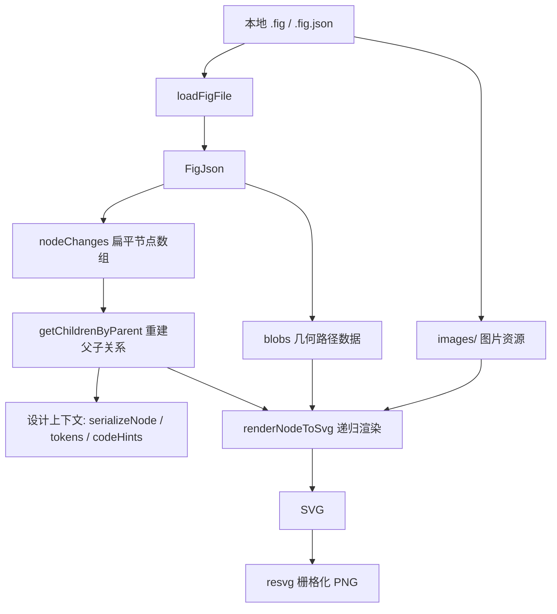

# .fig 数据结构与组装逻辑分析

本文档基于当前项目源码，说明本地 `.fig` 文件如何被解析成可查询的设计上下文，以及如何进一步组装成 SVG/PNG 导出结果。

## 1. 总体链路



核心结论：

- `.fig` 解码后的节点不是树形结构，而是 `nodeChanges` 扁平数组。
- 节点树通过 `guid` 和 `parentIndex.guid` 在运行时重建。
- 子节点层级顺序通过 `parentIndex.position` 排序。
- 矢量路径不直接保存在节点字段里，而是通过 `commandsBlob` 引用 `blobs[index]`。
- 图片资源来自 `.fig` 外层 zip 的 `images/<hash>`，不是来自 `FigJson.blobs`。

## 2. 文件读取与解码

入口：`src/services/fig-file.ts`

```ts
export function loadFigFile(filePath: string): FigJson {
  const absolutePath = path.resolve(filePath)
  if (absolutePath.toLowerCase().endsWith(".json")) {
    return JSON.parse(fs.readFileSync(absolutePath, "utf8")) as FigJson
  }

  return figToJson(fs.readFileSync(absolutePath))
}
```

读取策略：

- `.fig.json`：直接作为已经解码过的 JSON 读取。
- `.fig`：调用 `figToJson` 解析 Figma 本地文件。

`.fig` 解码入口：`src/services/fig2json.ts`

主要步骤：

1. 判断输入是否已经是 `fig-kiwi` 格式。
2. 如果不是 `fig-kiwi`，按 zip 解析并取出 `canvas.fig`。
3. 从 `canvas.fig` 里切分二进制 parts。
4. 对 part 做解压：
   - zstd magic 开头：使用 `fzstd` 解压。
   - PNG magic 开头：保留。
   - 其他内容：使用 `UZIP.inflateRaw` 解压。
5. 第一个 part 是 schema，第二个 part 是 data。
6. 使用 `kiwi-schema` 解码 schema，再 decode data。
7. 将 `blobs` 转成 base64，得到项目内部使用的 `FigJson`。

输出的 `FigJson` 还会附带 `__figmaToJson` 元信息：

```ts
{
  __figmaToJson: {
    schema: string,
    delimiter: number
  }
}
```

## 3. 核心数据结构

类型定义入口：`src/services/fig-types.ts`

### 3.1 FigJson

```ts
export type FigJson = {
  type?: string
  sessionID?: number
  ackID?: number
  nodeChanges?: FigNode[]
  blobs?: string[]
  __figmaToJson?: {
    schema: string
    delimiter: number
  }
}
```

字段含义：

- `nodeChanges`：所有节点的扁平列表。
- `blobs`：几何路径 blob，已被转为 base64 字符串。
- `sessionID` / `ackID`：文件级元信息。
- `__figmaToJson`：当前项目解码时保存的 schema 和 delimiter 信息。

### 3.2 FigNode

```ts
export type FigNode = {
  guid: Guid
  parentIndex?: { guid: Guid; position?: string }
  type?: string
  name?: string
  visible?: boolean
  opacity?: number
  size?: { x: number; y: number }
  transform?: FigmaMatrix
  fillPaints?: FigPaint[]
  strokePaints?: FigPaint[]
  fillGeometry?: FigGeometry[]
  strokeGeometry?: FigGeometry[]
  effects?: FigEffect[]
  textData?: FigTextData
  derivedTextData?: FigDerivedTextData
}
```

重要字段：

- `guid`：节点唯一标识。
- `parentIndex.guid`：父节点标识。
- `parentIndex.position`：同级节点排序信息，也是 z-order 的关键。
- `type`：节点类型，例如 `DOCUMENT`、`FRAME`、`TEXT`、`VECTOR`、`ELLIPSE`。
- `size`：节点本地尺寸。
- `transform`：节点相对父级的 2D 变换矩阵。
- `fillPaints` / `strokePaints`：填充和描边 paint。
- `fillGeometry` / `strokeGeometry`：几何数据引用。
- `effects`：阴影、模糊等效果。
- `textData` / `derivedTextData`：文本内容、样式覆盖、glyph 路径等。

### 3.3 Guid 与 node-id

```ts
export type Guid = {
  sessionID: number
  localID: number
}
```

项目内部将它标准化为：

```ts
`${sessionID}:${localID}`
```

相关工具：`src/utils/node-id.ts`

- `keyForGuid(guid)`：把 `{ sessionID, localID }` 转成 `sessionID:localID`。
- `normalizeNodeId(value)`：支持 `123:456`、`123-456`、`node-id=123-456` 和完整 Figma 链接。

### 3.4 Geometry 与 Blob

```ts
export type FigGeometry = {
  commandsBlob: number
  windingRule?: string
  styleID?: number
}
```

`commandsBlob` 是 `FigJson.blobs` 的索引。例如：

```ts
const blob = figJson.blobs?.[geometry.commandsBlob]
```

blob 内容是 base64 编码的紧凑路径命令。渲染时会被解析为 SVG path。

当前支持的路径命令：

| opcode | SVG 命令 | 含义 |
| --- | --- | --- |
| `1` | `M` | moveTo |
| `2` | `L` | lineTo |
| `3` | `Q` | quadraticCurveTo |
| `4` | `C` | cubicCurveTo |
| `0` | `Z` | closePath |

解析入口：`src/services/fig-node-svg.ts` 的 `parsePathBlob`。

### 3.5 Paint

```ts
export type FigPaint = {
  type: "SOLID" | "GRADIENT_LINEAR" | string
  color?: FigColor
  opacity?: number
  visible?: boolean
  stops?: Array<{ color: FigColor; position: number }>
  transform?: FigmaMatrix
  image?: { hash?: Uint8Array | number[] | string; name?: string }
  imageThumbnail?: { hash?: Uint8Array | number[] | string; name?: string }
}
```

当前 SVG 渲染重点支持：

- `SOLID`
- `GRADIENT_LINEAR`
- `GRADIENT_RADIAL`
- `IMAGE`

`IMAGE` paint 会通过 `image.hash` 或 `imageThumbnail.hash` 去匹配 `.fig` zip 外层的 `images/<hash>`。

## 4. 节点树组装逻辑

组装入口：`src/services/fig-node-svg.ts`

```ts
export function getChildrenByParent(figJson: FigJson): Map<string, FigNode[]> {
  const childrenByParent = new Map<string, FigNode[]>()
  for (const node of figJson.nodeChanges ?? []) {
    if (!node.parentIndex?.guid) continue

    const parentKey = keyForGuid(node.parentIndex.guid)
    const children = childrenByParent.get(parentKey) ?? []
    children.push(node)
    childrenByParent.set(parentKey, children)
  }

  return childrenByParent
}
```

组装结果是：

```ts
Map<parentNodeId, childNodes[]>
```

节点自身 id：

```ts
keyForGuid(node.guid)
```

父节点 id：

```ts
keyForGuid(node.parentIndex.guid)
```

子节点排序：

```ts
function getSortedChildren(context: RenderContext, node: FigNode): FigNode[] {
  return [...(context.childrenByParent.get(keyForGuid(node.guid)) ?? [])].sort((a, b) =>
    comparePosition(a.parentIndex?.position ?? "", b.parentIndex?.position ?? "")
  )
}
```

排序使用字符串原始比较：

```ts
if (left === right) return 0
return left < right ? -1 : 1
```

原因是 `parentIndex.position` 是 fractional-index 字符串，使用 locale-aware 排序可能会重排标点，从而改变 Figma 原始 z-order。

## 5. 目标节点查找

入口：`findTargetNode`

查找逻辑：

1. 先尝试从 `nodeId` 或 `nodeQuery` 中解析标准 node-id。
2. 如果能解析成 `sessionID:localID`，按 `guid` 查找。
3. 如果不能解析，则按节点名称精确匹配。

```ts
const target = normalizedNodeId
  ? nodes.find((node) => keyForGuid(node.guid) === normalizedNodeId)
  : nodes.find((node) => node.name === nodeName)
```

因此当前项目的节点查询不是模糊搜索。模糊搜索只存在于 `listFigNodes` 的查询列表逻辑里。

## 6. 设计上下文组装

入口：`src/services/design-context.ts`

### 6.1 getDesignContext

流程：

1. `loadFigFile` 读取文件。
2. `getChildrenByParent` 组装父子映射。
3. 根据 `nodeQuery` 找目标节点；没有传则找根节点。
4. `serializeNode` 输出节点摘要和子树。
5. 可选输出 tokens。
6. 可选输出 codeHints。

输出结构：

```ts
{
  kind: "figma-local-design-context",
  filePath,
  query,
  node,
  tokens,
  codeHints
}
```

### 6.2 serializeNode

`serializeNode` 会输出：

- 基础摘要：id、name、type、size、visible、opacity。
- 父节点 id。
- 子节点数量。
- paint 和 effect 是否存在。
- transform、stroke、arcData。
- 简化 fills / strokes。
- geometry 数量。
- 指定深度内的 children。

这部分适合给模型或上层工具提供可读的设计上下文。

### 6.3 tokens 推导

`collectDesignTokens` 并不读取 Figma 变量或全局样式注册表，而是从当前子树中推导：

- 颜色
- 线性渐变
- 投影
- 描边宽度

源码里也明确说明：本地 `.fig` 解码目前还没有解析 Figma 的变量和样式 registry。

## 7. SVG 组装逻辑

入口：`renderNodeToSvg`

流程：

1. 找目标节点。
2. 重建 `childrenByParent`。
3. 初始化 `RenderContext`。
4. 调用 `renderNodeSubtree` 递归生成 SVG body。
5. 根据节点尺寸、实际渲染 bounds 和 effect bounds 计算导出 viewBox。
6. 拼接 `<svg>`、`<defs>`、背景和 body。

### 7.1 RenderContext

```ts
type RenderContext = {
  figJson: FigJson
  childrenByParent: Map<string, FigNode[]>
  defs: string[]
  rasterHints: FigmaLikeRasterHint[]
  imageAssets: FigImageAssets
  bounds: Bounds | null
  effectBounds: Bounds | null
  idSeed: number
  pngFigmaLike: boolean
}
```

关键字段：

- `defs`：渐变、clipPath、filter 等 SVG 定义。
- `rasterHints`：PNG 阶段需要额外像素补偿的信息。
- `imageAssets`：图片 hash 到 data URL 的映射。
- `bounds`：普通可见内容范围。
- `effectBounds`：阴影、模糊等效果扩展范围。

### 7.2 renderNodeSubtree

递归渲染顺序：

1. 跳过 `visible === false` 的节点。
2. 合并父级矩阵和当前节点 transform。
3. 渲染 fill geometry。
4. 渲染文本 glyph。
5. 收集 Figma-like PNG raster hint。
6. 渲染 stroke。
7. 递归渲染 children。
8. 给当前节点包一层 `<g>`，附加 opacity 和 filter。

特殊处理：

- `BOOLEAN_OPERATION` 如果已经有计算后的几何路径，就不再渲染源 children。
- mask 节点会转成 `clipPath`，后续 sibling 会被 clip。
- effect 作为节点级 filter 包在 `<g>` 上，而不是只包单个 path。

### 7.3 transform 组装

Figma 矩阵：

```ts
{
  m00, m01, m02,
  m10, m11, m12
}
```

SVG matrix：

```ts
[m00, m10, m01, m11, m02, m12]
```

转换入口：

```ts
function toSvgMatrix(matrix?: FigmaMatrix): SvgMatrix
```

递归时通过矩阵乘法累积：

```ts
const matrix = multiply(parentMatrix, localMatrix)
```

这样子节点最终会进入根节点坐标空间。

## 8. 几何路径渲染

几何渲染入口：`renderGeometry`

流程：

1. 读取 `fillGeometry` 或 `strokeGeometry`。
2. 用 `commandsBlob` 找到 `figJson.blobs[index]`。
3. `parsePathBlob` 转成 SVG path `d`。
4. 计算 bounds。
5. 根据 paint 类型输出对应 SVG。

普通填充：

```svg
<path d="..." fill="..." />
```

奇偶填充规则：

```svg
fill-rule="evenodd"
```

描边优先使用 SVG stroke 属性，而不是直接填充 decoded `strokeGeometry`。原因是 Figma 的 decoded `strokeGeometry` 更像内部栅格使用的扩展轮廓，直接填充可能让细描边变粗。

## 9. 图片资源组装

图片读取入口：`src/services/fig-images.ts`

流程：

1. 只对 `.fig` 生效，`.json` 返回空 Map。
2. 判断文件是否是 zip。
3. 解析 zip。
4. 遍历 `images/` 下的资源。
5. 通过文件头识别 mime：
   - PNG
   - JPEG
   - GIF
   - WEBP
6. 存成：

```ts
Map<hash, dataUrl>
```

图片渲染入口：`renderImageFill`

流程：

1. 从 `paint.image.hash` 或 `paint.imageThumbnail.hash` 得到 hash。
2. 在 `imageAssets` 中查找 data URL。
3. 用当前矢量路径创建 `clipPath`。
4. 输出一个单位尺寸 `<image width="1" height="1">`。
5. 用 `paint.transform` 和节点尺寸计算 image matrix。
6. 用 wrapper `<g clip-path="...">` 裁切图片。

这样可以把 Figma 的图片裁切、填充和矢量路径边界转成 SVG 近似表达。

## 10. 文本渲染

文本节点不直接输出 `<text>`，而是使用 glyph path。

入口：`renderTextNode`

流程：

1. 判断 `node.type === "TEXT"`。
2. 读取 `derivedTextData.glyphs`。
3. 每个 glyph 通过 `commandsBlob` 解析出路径。
4. 根据 glyph 的 position、fontSize、rotation 计算矩阵。
5. 根据 `textData.characterStyleIDs` 和 `styleOverrideTable` 找到 glyph 对应 paint。
6. 将相同 paint 的 glyph path 合并成一个 `<path>`。

关键转换：

```ts
const scale: SvgMatrix = [fontSize, 0, 0, -fontSize, 0, 0]
```

原因是 glyph blob 使用字体轮廓坐标，Y 轴向上；SVG 本地空间 Y 轴向下，所以要做垂直翻转。

## 11. 渐变与效果

### 11.1 线性渐变

入口：`paintToSvgFill` 中的 `GRADIENT_LINEAR` 分支。

逻辑：

- Figma 的 paint transform 是从对象空间回到单位渐变空间。
- SVG 需要的是 user space 中的 `x1/y1/x2/y2`。
- 所以代码会先对 transform 求逆，再投影到节点 box。

### 11.2 径向渐变

入口：`GRADIENT_RADIAL` 分支。

逻辑：

- 使用 `radialGradient`。
- 通过 `gradientTransform` 把单位圆投影到节点空间。

### 11.3 阴影与模糊

入口：`createNodeEffectFilter` 和 `createFilter`

支持的主要 effect：

- `DROP_SHADOW`
- `INNER_SHADOW`
- `FOREGROUND_BLUR`
- `LAYER_BLUR`

SVG 导出时会生成 `<filter>`，并放入 `context.defs`。

PNG 的 `figma-like` 模式对椭圆内阴影有额外处理：

- SVG 阶段记录 `rasterHints`。
- PNG 阶段在 `export-node.ts` 中直接操作像素。
- 目的是补偿 `resvg` 和 Figma 原生 PNG 渲染在内阴影边缘上的差异。

## 12. PNG 导出逻辑

入口：`src/services/export-node.ts`

流程：

1. `renderNodeToSvg` 先生成 SVG。
2. 使用 `new Resvg(rendered.svg).render()` 栅格化。
3. 如果是普通预览，直接 `image.asPng()`。
4. 如果是 `figma-like`，先拿 RGBA pixels，再应用 raster hints。
5. 使用项目内的 PNG encoder 写回 PNG。

当前导出能力说明：

- SVG：本地结构化输出。
- PNG：本地 SVG 经过 `@resvg/resvg-js` 栅格化。
- Figma-like PNG：额外补偿部分滤镜和内阴影。
- Figma native PNG：当前不支持，因为没有调用 Figma 官方渲染器。

## 13. 当前实现边界

当前项目已经支持：

- 本地 `.fig` 和 `.fig.json` 读取。
- 节点列表、节点上下文、设计上下文。
- 子树序列化。
- 颜色、渐变、阴影、描边宽度 token 推导。
- SVG 导出。
- PNG 预览导出。
- 图片填充。
- 文本 glyph path 渲染。
- mask 到 clipPath 的转换。
- 线性和径向渐变。
- 虚线描边。
- 部分 filter 和 Figma-like PNG 补偿。

主要限制：

- 不解析 Figma 官方变量和样式 registry。
- 不保证 PNG 与 Figma native export 像素级一致。
- `getDesignContext` 里的节点查找是精确名称或精确 node-id。
- `.fig.json` 不包含 zip 外层图片资源时，`IMAGE` 填充无法恢复真实图片。
- 复杂 blend mode、组件实例覆盖、变量绑定、auto layout 语义等还没有完整建模。

## 14. 源码入口索引

| 功能 | 文件 | 关键函数 |
| --- | --- | --- |
| 文件读取 | `src/services/fig-file.ts` | `loadFigFile` |
| `.fig` 解码 | `src/services/fig2json.ts` | `figToJson` |
| 类型定义 | `src/services/fig-types.ts` | `FigJson`、`FigNode`、`FigPaint` |
| 节点 id 处理 | `src/utils/node-id.ts` | `keyForGuid`、`normalizeNodeId` |
| 父子关系组装 | `src/services/fig-node-svg.ts` | `getChildrenByParent` |
| 目标节点查找 | `src/services/fig-node-svg.ts` | `findTargetNode` |
| SVG 渲染 | `src/services/fig-node-svg.ts` | `renderNodeToSvg`、`renderNodeSubtree` |
| 路径解析 | `src/services/fig-node-svg.ts` | `parsePathBlob` |
| 图片资源读取 | `src/services/fig-images.ts` | `loadFigImageAssets` |
| 设计上下文 | `src/services/design-context.ts` | `getDesignContext`、`getCodeContext` |
| token 推导 | `src/services/design-context.ts` | `collectDesignTokens` |
| 导出文件 | `src/services/export-node.ts` | `exportFigNode` |
| MCP 工具注册 | `src/mcp/index.ts` | `createServer` |

## 15. 简化伪代码

```ts
const figJson = loadFigFile(filePath)
const imageAssets = loadFigImageAssets(filePath)
const childrenByParent = getChildrenByParent(figJson)
const target = findTargetNode(figJson, { nodeQuery })

const svg = renderNodeToSvg(figJson, {
  nodeQuery,
  imageAssets,
  scale,
  pngFigmaLike
})

if (format === "png") {
  const image = new Resvg(svg).render()
  writePng(image)
} else {
  writeSvg(svg)
}
```

这就是当前项目对 `.fig` 的核心处理方式：先把 Figma 本地文件解成扁平数据，再用 `guid` 关系重建节点树，最后把节点、几何 blob、paint、图片资源和 effect 递归组合成可导出的 SVG/PNG。
